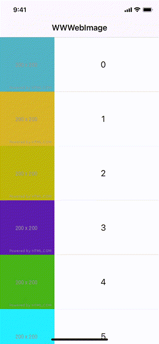

# :no_entry: [DEPRECATED - 已不再維護](https://github.com/William-Weng/WWWebImage)

# WWWebImage

[](https://developer.apple.com/swift/) [](https://developer.apple.com/swift/) [](https://developer.apple.com/swift/) [](https://developer.apple.com/swift/)

This is a simple UIImage image download tool.

這是一個簡單的UIImage圖片下載工具。



### [Installation with Swift Package Manager](https://medium.com/彼得潘的-swift-ios-app-開發問題解答集/使用-spm-安裝第三方套件-xcode-11-新功能-2c4ffcf85b4b)
```bash
dependencies: [
    .package(url: "https://github.com/William-Weng/WWWebImage.git", .upToNextMajor(from: "1.0.0"))
]
```

### Example
```swift
import UIKit
import WWWebImage
import WWPrint

final class TableViewDemoController: UIViewController {

    @IBOutlet weak var myTableView: UITableView!
    
    override func viewDidLoad() {
        super.viewDidLoad()
        
        myTableView.delegate = self
        myTableView.dataSource = self
        
        WWWebImage.configure(maximumCache: 1_000_000, compressionQuality: 0.8, sizeMark: .width(128))
    }
}

extension TableViewDemoController: UITableViewDelegate, UITableViewDataSource {
    
    func tableView(_ tableView: UITableView, numberOfRowsInSection section: Int) -> Int {
        return MyTableViewCell.ImageUrlInfos.count
    }
    
    func tableView(_ tableView: UITableView, cellForRowAt indexPath: IndexPath) -> UITableViewCell {
        
        let cell = tableView.dequeueReusableCell(withIdentifier: "MyTableViewCell", for: indexPath) as! MyTableViewCell
        cell.configure(with: indexPath)
        
        return cell
    }
    
    func tableView(_ tableView: UITableView, didSelectRowAt indexPath: IndexPath) {
        
        let result = WWWebImage.cachesDirectorySize()
        
        switch result {
        case .failure(let error): wwPrint(error)
        case .success(let info): wwPrint(info)
        }
    }
}
```
```swift
import UIKit
import WWPrint
import WWWebImage

final class MyTableViewCell: UITableViewCell {

    static let ImageUrlInfos: [String] = UIImage._randomUrlString(with: 20)
    
    @IBOutlet weak var myImageView: UIImageView!
    @IBOutlet weak var myLabel: UILabel!
    
    override func prepareForReuse() {
        super.prepareForReuse()
        myImageView.image = nil
    }
    
    /// 畫面相關設定
    /// - Parameter indexPath: IndexPath
    func configure(with indexPath: IndexPath) {
        
        let urlString = Self.ImageUrlInfos[indexPath.row]
        
        myLabel.text = "\(indexPath.row)"
        
        myImageView.ww.downloadImage(with: urlString) { result in
            switch result {
            case .failure(let error): wwPrint(error)
            case .success(let info): wwPrint(info)
            }
        }
    }
}

// MARK: - UIImage (class function)
extension UIImage {
    
    /// [產生隨機的小圖片](https://medium.com/彼得潘的-swift-ios-app-開發問題解答集/collection-view-table-view-的網路圖片顯示問題-e83c5ca487c8)
    /// - https://via.placeholder.com/200/8C61ED
    /// - Parameter count: 圖片數量
    /// - Parameter size: 圖片大小
    /// - Parameter placeholderUrl: 圖片網址
    /// - Returns: [String]?
    static func _randomUrlString(with count: UInt = 10, size: UInt = 200, placeholderUrl: String = "https://via.placeholder.com") -> [String] {
        
        let photoUrls = (1...count).map { number -> String in
            
            let rgb = (1...3).reduce("") { result, _ in
                result.appending(String(Int.random(in: 0...255), radix: 16, uppercase: true))
            }
            
            return "\(placeholderUrl)/\(size)/\(rgb)"
        }

        return photoUrls
    }
}
```
